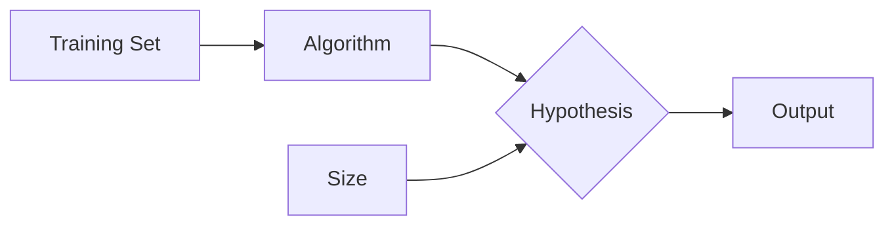

> python -> https://learnxinyminutes.com/docs/python/
> http://cs229.stanford.edu/syllabus-summer2020.html
### Types :
![[Pasted image 20230806113954.png]]

### 1. Supervised ML
- we train the machine with the input and corresponding output, and then we ask the machine to predict the output using the test dataset.

### Categories :
1. Classification
2. Regression

### 2. Unsupervised ML
- The main aim of the unsupervised learning algorithm is to group or categories the unsorted dataset according to the similarities, patterns, and differences.

### Categories :
1. Clustering
2. Association

### 3. Semi-Supervised Learning
- The main aim of semi-supervised learning is to effectively use all the available data, rather than only labelled data like in supervised learning. Initially, similar data is clustered along with an unsupervised learning algorithm, and further, it helps to label the unlabeled data into labelled data. It is because labelled data is a comparatively more expensive acquisition than unlabeled data.

### 4. Reinforcement Learning
- Reinforcement learning works on a feedback-based process, in which an AI agent (A software component) automatically explore its surrounding by hitting & trail, taking action, learning from experiences, and improving its performance
- Similar to human being

### Categories :
1. +ve RL
2.  -ve RL

## Lecture 2 :: CS229 :: Linear Regression & Gradient Descent

### Designing a Learning Algorithm

#### Represent Hypothesis
![[Pasted image 20230806181125.png]]

where,
	x1 is size

- there can be n numbers of $\theta$ (parameters) . each $\theta$ representing inputs like size, rooms, height etc.
- choose value of $\theta$ that minimizes j($\theta$) 
![[Pasted image 20230806185228.png]]
- 1/2 constant added to simplify maths later.

### Gradient Descent 
![[Pasted image 20230806185749.png]]

some go lang in IRL
![[Pasted image 20230806190147.png]]

	$\alpha$ is learning rate.

#### Importance of Learning Rate
![[Pasted image 20230806194600.png]]

![[WhatsApp Image 2023-08-06 at 19.34.36 1.jpg]]

### Why J($\theta$) squared?

- when not
![[Pasted image 20230806193703.png]]
- when squared
![[Pasted image 20230806193801.png]]
![[Pasted image 20230806193915.png]]

#### This algo is also known as batch gradient descent.
### Limitations:
1. for each iterations, processes whole database.

### Stochastic Gradient Descent
- to tackle limitation of batch gradient descent.

- using a normal equation to derive it. (only applicable for linear regression)
![[Pasted image 20230806202944.png]]
![[Pasted image 20230806203206.png]]
![[Pasted image 20230806203346.png]]
![[Pasted image 20230806203409.png]]

![[WhatsApp Image 2023-08-06 at 20.42.24.jpg]]

<--END OF LECTURE-->

# Lecture 3 :: Locally Weighted & Logistic Regression

## Locally Weighted Regression

Detailed : http://cs229.stanford.edu/syllabus-summer2020.html

- Non - parametric algorithm

Consider the problem of predicting y from x ∈ R. The leftmost figure below shows the result of fitting a y = θ0 + θ1x to a dataset. We see that the data doesn’t really lie on straight line, and so the fit is not very good.

![[Pasted image 20230807182814.png]]
In contrast, the locally weighted linear regression algorithm does the following: 
1. Fit θ to minimize 
![[Pasted image 20230807182942.png]]
2. Output $θ^T$ x.

![[Pasted image 20230807183003.png]]

- Here, the w (i) ’s are non-negative valued weights. Intuitively, if w (i) is large for a particular value of i, then in picking θ, we’ll try hard to make (y (i) − θ T x (i) ) 2 small. If w (i) is small, then the (y (i) − θ T x (i) ) 2 error term will be pretty much ignored in the fit.

- τ is called the bandwidth parameter

## Probabilistic Interpretation